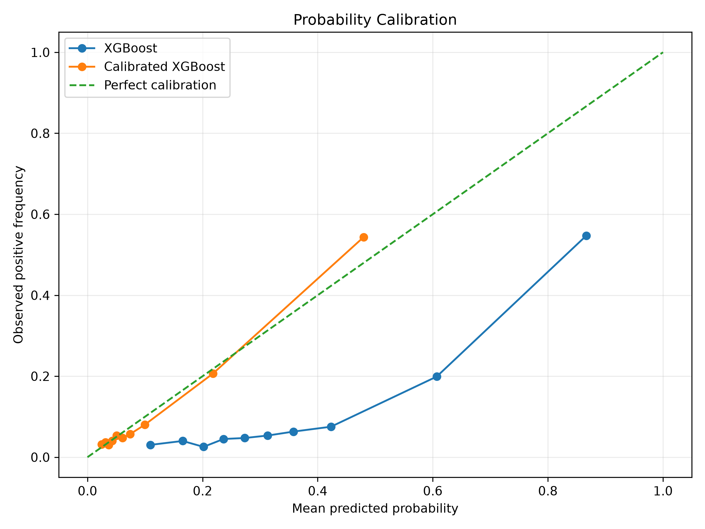
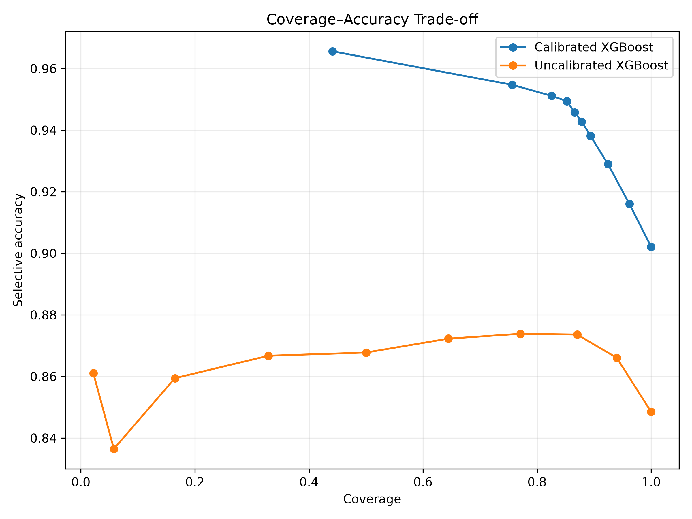
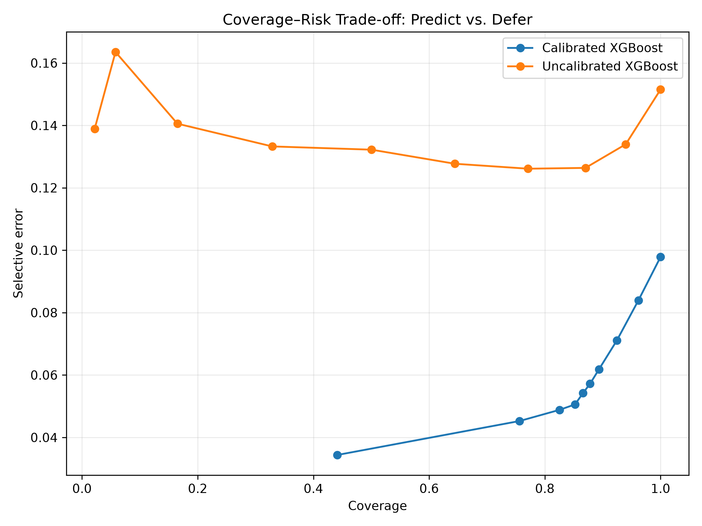
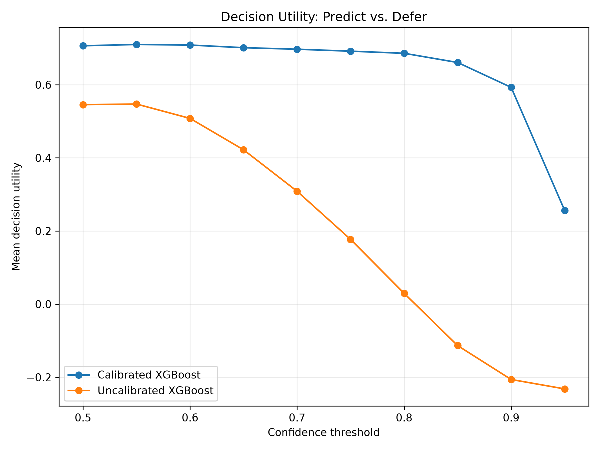
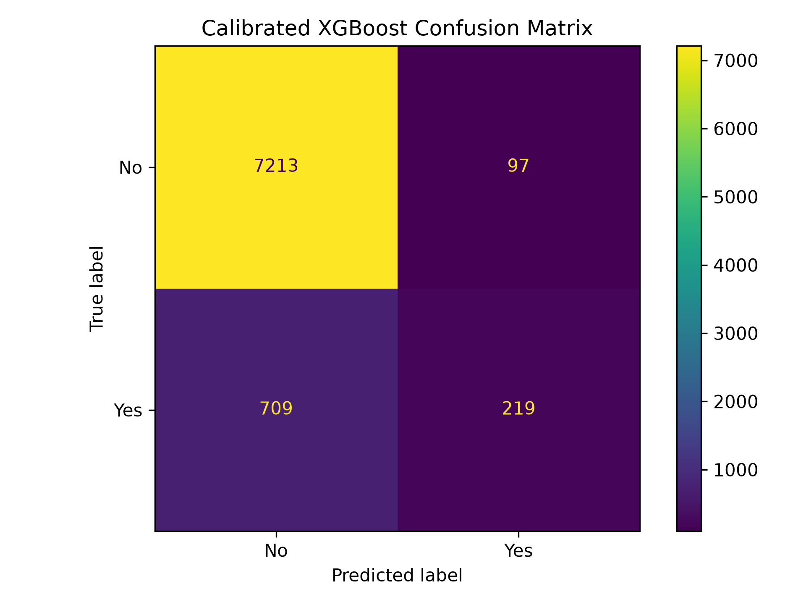

# Data-Driven Decision Intelligence with Uncertainty-Calibrated AI


A decision-intelligence project that combines machine learning with calibrated uncertainty to decide when to automatically predict and when to defer to a human reviewer.

## Short project description

This project studies whether probability calibration improves an AI decision system's ability to determine when a prediction is reliable enough for automation and when a case should be escalated for human review. The workflow compares standard classifiers with a sigmoid-calibrated XGBoost model and evaluates the trade-off between coverage, deferment, selective accuracy, and decision utility.

## Why this matters

In real decision systems, the key question is not only whether the model is accurate, but whether its confidence is trustworthy. Poor calibration can cause a model to be overconfident in risky cases. This project evaluates a predict-or-defer policy that uses calibrated probabilities to manage operational uncertainty in a principled way.

## Methods compared

- Random Forest
- XGBoost
- Sigmoid-calibrated XGBoost

## Key comparison summary

The final experiment shows that calibration materially improves reliability for decision-making:

- Random Forest: Accuracy 0.8634, Brier score 0.1396, ECE 0.2429
- XGBoost: Accuracy 0.8485, Brier score 0.1432, ECE 0.2427
- Calibrated XGBoost: Accuracy 0.9022, Brier score 0.0749, ECE 0.0148

At the selected policy threshold of 0.55, the calibrated model achieved:

- Mean utility: 0.7100
- Coverage: 0.9618
- Deferral rate: 0.0382
- Selective accuracy: 0.9161

This indicates that calibrated uncertainty supports a better operating point between automation and deferral.

## Screenshot gallery

### Calibration curve



### Coverage vs accuracy



### Coverage vs risk



### Utility threshold analysis



### Confusion matrix



## Dataset and task

This project uses the UCI Bank Marketing dataset. The target is whether a customer subscribes to a term deposit. The `duration` feature is removed because it is not fully known before the call outcome and could otherwise create unrealistic leakage in a decision-support setting.

## Predict-or-defer policy

```text
confidence = max(P(class=0), P(class=1))

if confidence >= threshold:
    PREDICT
else:
    DEFER TO HUMAN REVIEW
```

## Quick start

### 1. Clone the repository

```bash
git clone https://github.com/saching1302/user_network_behavior_research.git
cd user_network_behavior_research
```

### 2. Create and activate a virtual environment

```bash
python -m venv .venv
source .venv/bin/activate
```

### 3. Install dependencies

```bash
python -m pip install --upgrade pip
pip install -r requirements.txt
```

### 4. Download the dataset

```bash
python src/download_data.py
```

### 5. Run the experiment

```bash
python src/experiment.py
```

On Windows, you can also run:

```bat
run_all.bat
```

## Output files

- results/dataset_summary.csv
- results/model_metrics.csv
- results/calibration_metrics.csv
- results/selective_prediction.csv
- results/threshold_analysis.csv
- results/best_decision_policy.csv
- results/experiment_output.md

## Reproducibility

Random seed: 42

## License

This project is licensed under the MIT License.
